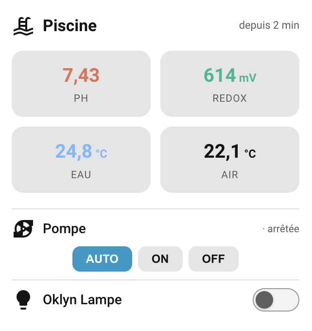

# Oklyn Card

[](https://github.com/ADNPolymerase/oklyn-card)
[](https://github.com/ADNPolymerase/oklyn-card/releases)
[](https://github.com/ADNPolymerase/oklyn-card/actions/workflows/hacs.yml)
[](https://www.home-assistant.io/)
[](https://github.com/ADNPolymerase/oklyn-card/blob/main/LICENSE)
[](https://buymeacoffee.com/adnpolymerase)

<a href="https://buymeacoffee.com/adnpolymerase" target="_blank"></a>

Custom Lovelace card for the [Oklyn pool controller integration](https://github.com/ADNPolymerase/ha-oklyn).

> 🇫🇷 Carte Lovelace pour l'intégration Oklyn — voir la section française plus bas.



## Features

- pH and RedOx readings with green/orange color thresholds
- Water temperature with optional color coding (blue / green / orange by threshold)
- Air temperature
- Pump control: **AUTO / ON / OFF** buttons on a dedicated row, with real running status
- Auxiliary 1 and 2 — each independently shown/hidden, type **switch** (toggleable) or **regulator** (read-only display)
- pH calibration offset (positive or negative)
- Last data update time (top right, optional)
- Full visual editor — no YAML needed
- **No dependency**: plain JavaScript, no Bubble Card or any other frontend plugin required

> Requires the [Oklyn integration](https://github.com/ADNPolymerase/ha-oklyn) to provide the entities:
> [](https://my.home-assistant.io/redirect/hacs_repository/?owner=ADNPolymerase&repository=ha-oklyn&category=integration)

## Installation (HACS)

1. **HACS → ⋮ → Custom repositories**
2. Add `https://github.com/ADNPolymerase/oklyn-card` with category **Dashboard**
3. Search for **Oklyn Card** and download it
4. Reload your browser (the resource is registered automatically)

## Manual installation

1. Copy `dist/oklyn-card.js` to `config/www/oklyn-card.js`
2. **Settings → Dashboards → ⋮ → Resources → Add resource**
   - URL: `/local/oklyn-card.js`
   - Type: JavaScript module

## Usage

Add the card from the dashboard UI (search "Oklyn") — entities are auto-detected.
Or in YAML:

```yaml
type: custom:oklyn-card
title: Piscine
model: analysis
ph_entity: sensor.oklyn_ph
orp_entity: sensor.oklyn_redox
water_entity: sensor.oklyn_temperature_eau
air_entity: sensor.oklyn_temperature_air
pump_entity: select.oklyn_mode_pompe
show_pump_runtime: false
show_aux1: true
aux1_entity: switch.oklyn_auxiliaire_1
aux1_mode: switch
aux1_icon: mdi:lightbulb
show_aux2: false
aux2_entity: switch.oklyn_auxiliaire_2
aux2_mode: switch
aux2_icon: mdi:power-socket-eu
ph_offset: 0
ph_color: true
ph_min: 6.8
ph_max: 7.6
orp_color: true
orp_min: 550
orp_max: 800
water_color: true
water_temp_blue: 26
water_temp_green: 30
show_last_updated: true
```

## Options

| Option | Default | Description |
|---|---|---|
| `model` | `analysis` | Oklyn model: `filtration` (temperatures only), `analysis` (+ pH, RedOx), `analysis_salt` (+ salt). Hides irrelevant metrics and editor options |
| `title` | Piscine | Card title |
| `metrics_order` | `[ph, orp, salt, water, air, runtime]` | Display order of the metric tiles — drag to reorder in the editor |
| `ph_entity` | — | pH sensor (`analysis` / `analysis_salt`) |
| `orp_entity` | — | RedOx/ORP sensor (`analysis` / `analysis_salt`) |
| `water_entity` | — | Water temperature sensor |
| `air_entity` | — | Air temperature sensor |
| `pump_entity` | — | Pump mode select entity |
| `show_pump_runtime` | `false` | Show cumulative pump runtime over the last 24h as a metric tile (computed from the pump status history, refreshed every 5 min) |
| `salt_entity` | — | Salt sensor in g/L (`analysis_salt` only) |
| `show_aux1` | `true` | Show the Auxiliary 1 row |
| `aux1_entity` | — | Auxiliary 1 switch or binary_sensor |
| `aux1_mode` | `switch` | `switch` = toggleable, `regulator` = read-only display |
| `aux1_icon` | `mdi:lightbulb` | Icon for the Auxiliary 1 row |
| `show_aux2` | `false` | Show the Auxiliary 2 row |
| `aux2_entity` | — | Auxiliary 2 switch or binary_sensor |
| `aux2_mode` | `switch` | Same as `aux1_mode` |
| `aux2_icon` | `mdi:power-socket-eu` | Icon for the Auxiliary 2 row |
| `show_last_updated` | `true` | Show last data update time (top right) |
| `ph_offset` | `0` | pH calibration correction, positive or negative (e.g. `-0.99`) |
| `ph_color` | `true` | Enable green/orange color coding for pH |
| `ph_min` / `ph_max` | 6.8 / 7.6 | Green zone for pH |
| `orp_color` | `true` | Enable green/orange color coding for RedOx |
| `orp_min` / `orp_max` | 550 / 800 | Green zone for RedOx (mV) |
| `salt_color` | `true` | Enable green/orange color coding for salt |
| `salt_min` / `salt_max` | 3 / 5 | Green zone for salt (g/L) |
| `water_color` | `true` | Enable color coding for water temperature |
| `water_temp_blue` | `26` | Below this threshold → blue (cold) |
| `water_temp_green` | `30` | Between blue and green threshold → green (ideal), above → orange (warm) |

### Water temperature color coding

| Range | Color | Meaning |
|---|---|---|
| ≤ `water_temp_blue` | 🔵 Blue | Cold |
| `water_temp_blue` – `water_temp_green` | 🟢 Green | Ideal |
| > `water_temp_green` | 🟠 Orange | Warm |

Disable with `water_color: false` to always show in the default text color.

### pH calibration offset

If your Oklyn pH probe drifts (e.g. reads 8.38 when a manual test says 7.39), set
`ph_offset` to `-0.99`. The card displays the corrected value with the label "pH corrigé",
and the thresholds apply to the corrected value. Leave at `0` for raw reading.

---

# 🇫🇷 Oklyn Card

Carte Lovelace pour l'[intégration Oklyn](https://github.com/ADNPolymerase/ha-oklyn).


## Fonctionnalités

- pH et RedOx avec seuils colorés (vert/orange)
- Température eau avec couleur optionnelle (bleu / vert / orange selon seuils réglables)
- Température air
- Contrôle pompe : boutons **AUTO / ON / OFF** sur une ligne dédiée, avec état réel de marche
- Auxiliaires 1 et 2 — chacun affichable/masquable, type **interrupteur** (commandable) ou **régulateur** (lecture seule, ex : doseur chlore)
- Correction de dérive pH (offset positif ou négatif)
- Heure de dernière mise à jour (en haut à droite, optionnel)
- Éditeur visuel complet — aucun YAML requis
- **Aucune dépendance** : JavaScript pur, pas besoin de Bubble Card ni d'aucun autre plugin

> Nécessite l'[intégration Oklyn](https://github.com/ADNPolymerase/ha-oklyn) :
> [](https://my.home-assistant.io/redirect/hacs_repository/?owner=ADNPolymerase&repository=ha-oklyn&category=integration)

## Installation (HACS)

1. **HACS → ⋮ → Dépôts personnalisés**
2. Ajouter `https://github.com/ADNPolymerase/oklyn-card` en catégorie **Dashboard**
3. Rechercher **Oklyn Card** et télécharger
4. Recharger le navigateur

Les entités sont détectées automatiquement. L'auxiliaire 1 est affiché par défaut ;
l'auxiliaire 2 se coche dans l'éditeur visuel.

## Licence

MIT
